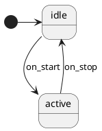

# Installing StateSmith CLI

The StateSmith CLI is needed to **regenerate** C code from `.puml` state machine
diagrams. Generated `.c`/`.h` files are committed to the repo, so installing
StateSmith is **only required when editing diagrams**.

## When you need it

✅ You're modifying a `.puml` file and need to regenerate the C code
✅ You're adding a new state machine feature
❌ You just want to build the firmware — generated files are already in the tree

## Quick install (Linux x86_64)

```bash
curl -sL https://github.com/StateSmith/StateSmith/releases/download/cli-v0.21.0-alpha-1/statesmith-linux-x64.tar.gz \
  -o /tmp/statesmith.tar.gz
tar xzf /tmp/statesmith.tar.gz -C /tmp/
mkdir -p ~/.local/bin
mv /tmp/ss.cli ~/.local/bin/statesmith
chmod +x ~/.local/bin/statesmith
```

Add to PATH if not already:
```bash
export PATH="$HOME/.local/bin:$PATH"
```

Verify:
```bash
statesmith --version
# Expected: StateSmith.Cli 0.21.0-alpha-1+...
```

## Other platforms

Releases for other platforms: https://github.com/StateSmith/StateSmith/releases

| Platform | Asset |
|----------|-------|
| Linux x86_64 | `statesmith-linux-x64.tar.gz` |
| Linux ARM64 | `statesmith-linux-arm64.tar.gz` |
| Linux ARM | `statesmith-linux-arm.tar.gz` |
| macOS Intel | `statesmith-osx-x64.tar.gz` |
| macOS Apple Silicon | `statesmith-osx-arm64.tar.gz` |
| Windows x64 | `statesmith-win-x64.zip` |
| Windows ARM64 | `statesmith-win-arm64.zip` |

All Linux/macOS archives contain a single `ss.cli` binary. Rename to `statesmith`
and place on your PATH.

## Alternative: install via dotnet

If you have .NET SDK installed:
```bash
dotnet tool install -g StateSmith.Cli
```

## First-run setup

StateSmith creates a settings directory on first run:
```
~/.config/StateSmith.Cli/  (Linux/macOS)
%APPDATA%\StateSmith.Cli\  (Windows)
```

When running non-interactively (CI, scripts), pass `--no-ask` to skip the
first-run wizard:
```bash
statesmith run --lang C99 --no-csx --no-ask path/to/diagram.puml
```

If the first-run wizard fails because the terminal isn't interactive, you can
seed the settings file manually:
```bash
mkdir -p ~/.config/StateSmith.Cli
cat > ~/.config/StateSmith.Cli/tool_settings.json << 'EOF'
{
  "firstRunDone": true,
  "lastUpdateCheck": "2026-01-01T00:00:00Z"
}
EOF
```

## Usage

### Generate a single diagram

```bash
statesmith run --lang C99 --no-csx --no-ask quantum/features/vim_modal.puml
```

Produces (next to the `.puml`):
- `VimModal.c` — generated state machine
- `VimModal.h` — header with state/event enums and API
- `VimModal.sim.html` — interactive simulator (gitignored, optional)

### Regenerate all diagrams

```bash
make statesmith-gen
```

Iterates over `quantum/features/*.puml` and regenerates each.

### CLI flags reference

| Flag | Purpose |
|------|---------|
| `--lang C99` | Target language (also: `Cpp`, `CSharp`, `JavaScript`, `Java`, `Python`, `TypeScript`) |
| `--no-csx` | Skip running `.csx` scripts (we don't use them) |
| `--no-ask` | Non-interactive mode for CI/scripts |
| `-r` | Recursive — process all `.puml` files in subdirectories |
| `-w` | Watch mode — regenerate on file change |
| `-b` | Force rebuild (ignore change detection) |
| `-v` | Verbose output |

## Generated code: post-processing

Generated `.c` files trigger `-Werror=unused-function` warnings in QMK's strict
build, so a `#pragma GCC diagnostic` guard must wrap the file. The
`make statesmith-gen` target applies this automatically after each
regeneration — no manual step needed.

If you invoke `statesmith` directly (not via `make`), apply the guard manually:

```bash
for f in quantum/features/*Sm.c; do
    if ! grep -q "pragma GCC diagnostic push" "$f"; then
        sed -i '1s/^/#ifdef __GNUC__\n#pragma GCC diagnostic push\n#pragma GCC diagnostic ignored "-Wunused-function"\n#endif\n/' "$f"
        printf '\n#ifdef __GNUC__\n#pragma GCC diagnostic pop\n#endif\n' >> "$f"
    fi
done
```

## Diagram syntax notes

StateSmith uses a **subset** of PlantUML. Key differences from standard PlantUML:

- ✅ `state name`, `[*] -> state`, `state --> state : event`
- ✅ Entry actions: `state : entry / action()`
- ❌ No `and`/`or` in transition labels — use one event per transition
- ⚠️  `[guard]` syntax on basic transitions: use `<<choice>>` pseudo-states.
  See https://github.com/StateSmith/StateSmith/wiki/PlantUML#layout-tip-extra-choice-states
  Example: `ROUTE -down-> TARGET : [my_guard_expr]`. The choice state itself
  is optimized away by StateSmith.
- ❌ `$VARS` block — StateSmith's variable declaration syntax for adding
  fields to the generated SM struct is **not supported in PlantUML mode**
  (verified with v0.21.0-alpha-1: parser rejects `$` at line start). It is
  a draw.io / `.csx` feature. If you need state beyond `state_id`, keep it
  in the wrapping adapter struct, not the generated SM struct. Derive
  redundant fields from `state_id` via inline helpers when possible.
- ✅ Comments: `'` single line, `/' ... '/` block
- ✅ State styles: `state foo <<red>>` with `skinparam state { ... }`

Working example:


## Troubleshooting

**"Unsupported file extension `.sm`"**
StateSmith expects `.puml`, `.plantuml`, `.pu`, or `.drawio` — not `.sm`. Rename
your files.

**"no viable alternative at input 'and'"**
You can't use `and` in transition labels. Split into multiple transitions or
handle the guard in adapter code.

**"Cannot show selection prompt since the current terminal isn't interactive"**
Pass `--no-ask` and seed the settings file (see First-run setup above).

**Generated `*_state_id_to_string()` causes flash bloat**
Wrap behind `#ifdef DEBUG` in your build, or use `--state-id-as-int` flag if
your version supports it.

## See also

- [StateSmith homepage](https://github.com/StateSmith/StateSmith)
- [Wiki: Usage](https://github.com/StateSmith/StateSmith/wiki/CLI:-Usage)
- [Wiki: PlantUML guide](https://github.com/StateSmith/StateSmith/wiki/PlantUML)
- [Features README](../../quantum/features/README.md) — when to use SM vs plain C
- [Pipeline outcome doc](../plans/2026-05-11-key-processing-pipeline-outcome.md)
