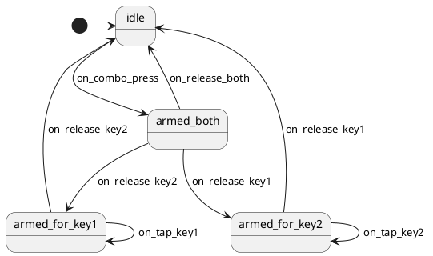

# Sticky Combo Implementation Plan

> **For Claude:** REQUIRED SUB-SKILL: Use superpowers:executing-plans to implement this plan task-by-task.

**Goal:** Add a "sticky combo" feature: press key1+key2 simultaneously to fire a combo action, then keep one key held while tapping the other to fire per-key sticky actions.

**Architecture:** New feature in `quantum/features/` using the existing `KEY_PROCESSING_SM_ENABLE` pipeline. 4-state StateSmith machine handles state transitions; adapter handles simultaneous-press detection, key tracking, and action dispatch. User declares `sticky_combos[]` array in keymap.

**Tech Stack:** StateSmith CLI (code gen), C (embedded), QMK firmware build system, the pipeline orchestrator (`quantum/pipeline.c/h`) already in place.

**Reference:** [Design doc](2026-05-11-sticky-combo-design.md)

---

### Task 1: State Machine Diagram

**Files:**
- Create: `quantum/features/sticky_combo.puml`

**Step 1: Write the PlantUML diagram**



**Step 2: Generate C code**

Run: `~/.local/bin/statesmith run --lang C99 --no-csx --no-ask quantum/features/sticky_combo.puml`

Expected output: `quantum/features/StickyCombo.c` and `quantum/features/StickyCombo.h` created.

**Step 3: Add pragma guard for -Wunused-function**

```bash
f=quantum/features/StickyCombo.c
if ! grep -q "pragma GCC diagnostic push" "$f"; then
    sed -i '1s/^/#ifdef __GNUC__\n#pragma GCC diagnostic push\n#pragma GCC diagnostic ignored "-Wunused-function"\n#endif\n/' "$f"
    printf '\n#ifdef __GNUC__\n#pragma GCC diagnostic pop\n#endif\n' >> "$f"
fi
```

**Step 4: Verify generated header has expected enums**

Run: `grep -E "StateId_|EventId_" quantum/features/StickyCombo.h`

Expected to see at minimum:
- `StickyCombo_EventId_ON_COMBO_PRESS`
- `StickyCombo_EventId_ON_RELEASE_KEY1`
- `StickyCombo_EventId_ON_RELEASE_KEY2`
- `StickyCombo_EventId_ON_RELEASE_BOTH`
- `StickyCombo_EventId_ON_TAP_KEY1`
- `StickyCombo_EventId_ON_TAP_KEY2`
- `StickyCombo_StateId_IDLE`
- `StickyCombo_StateId_ARMED_BOTH`
- `StickyCombo_StateId_ARMED_FOR_KEY1`
- `StickyCombo_StateId_ARMED_FOR_KEY2`

**Step 5: Commit**

```bash
git add quantum/features/sticky_combo.puml quantum/features/StickyCombo.c quantum/features/StickyCombo.h
git commit -m "feat: add sticky combo state machine diagram and generated code"
```

---

### Task 2: Adapter Header and Public Definition Types

**Files:**
- Create: `quantum/features/sticky_combo_adapter.h`

**Step 1: Write the header**

```c
// quantum/features/sticky_combo_adapter.h
#pragma once

#include <stdint.h>
#include "pipeline.h"

// User-provided definition of a sticky combo.
// key1 + key2 pressed simultaneously fires combo_action.
// After that, with key2 held, tapping key1 fires tap_action_1.
// With key1 held, tapping key2 fires tap_action_2.
// Any action set to KC_NO (0) is silently skipped.
typedef struct {
    uint16_t key1;
    uint16_t key2;
    uint16_t combo_action;
    uint16_t tap_action_1;
    uint16_t tap_action_2;
} sticky_combo_def_t;

// User must provide these in their keymap:
extern const sticky_combo_def_t sticky_combos[];
extern const uint8_t sticky_combo_count;

// Pipeline registration entry point.
sm_machine_t *sticky_combo_machine_get(void);
```

**Step 2: Commit**

```bash
git add quantum/features/sticky_combo_adapter.h
git commit -m "feat: add sticky_combo_adapter.h with public API"
```

---

### Task 3: Adapter — Idle State and Simultaneous Press Detection

**Files:**
- Create: `quantum/features/sticky_combo_adapter.c`

**Step 1: Write the skeleton with idle-state detection**

```c
// quantum/features/sticky_combo_adapter.c
#include "sticky_combo_adapter.h"
#include "pipeline.h"
#include "timer.h"
#include "quantum_keycodes.h"
#include "action.h"
#include "StickyCombo.h"

#ifndef STICKY_COMBO_WINDOW_MS
#define STICKY_COMBO_WINDOW_MS 50
#endif

typedef struct {
    StickyCombo sm;
    int8_t  active_combo;         // index into sticky_combos[], -1 if none
    bool    key1_held;            // physical state of active combo's key1
    bool    key2_held;            // physical state of active combo's key2

    // Pending first-press for simultaneous-press detection
    uint16_t pending_keycode;
    int8_t   pending_combo;       // which combo's key was first pressed; -1 if none
    bool     pending_is_key1;     // true if pending is key1 of pending_combo
    uint16_t pending_time;
} sticky_combo_state_t;

static sticky_combo_state_t sc_state = {.active_combo = -1, .pending_combo = -1};
static sm_machine_t sticky_combo_machine;

// Lookup: does this keycode appear as key1 or key2 in any defined combo?
// Returns combo index and sets *is_key1 / *is_key2. Returns -1 if not found.
static int8_t find_combo_for_key(uint16_t kc, bool *is_key1, bool *is_key2) {
    for (uint8_t i = 0; i < sticky_combo_count; i++) {
        if (sticky_combos[i].key1 == kc) { *is_key1 = true;  *is_key2 = false; return i; }
        if (sticky_combos[i].key2 == kc) { *is_key1 = false; *is_key2 = true;  return i; }
    }
    return -1;
}

static sm_result_t sticky_combo_handle(void *self, keyevent_t *event, keyrecord_t *record) {
    sticky_combo_state_t *st = self;
    uint16_t kc = get_record_keycode(record, true);

    // TODO: states armed_both, armed_for_key1, armed_for_key2 in later tasks

    if (st->sm.state_id == StickyCombo_StateId_IDLE) {
        if (!event->pressed) return SM_PASS;  // releases pass through in idle

        bool is_key1 = false, is_key2 = false;
        int8_t combo = find_combo_for_key(kc, &is_key1, &is_key2);
        if (combo < 0) return SM_PASS;  // not a combo key

        // Check if this completes a simultaneous press with pending
        if (st->pending_combo == combo &&
            timer_elapsed(st->pending_time) <= STICKY_COMBO_WINDOW_MS &&
            ((st->pending_is_key1 && is_key2) || (!st->pending_is_key1 && is_key1))) {
            // Simultaneous press detected
            st->active_combo = combo;
            st->key1_held = true;
            st->key2_held = true;
            st->pending_combo = -1;

            uint16_t action = sticky_combos[combo].combo_action;
            if (action != KC_NO) {
                tap_code16(action);
            }
            StickyCombo_dispatch_event(&st->sm, StickyCombo_EventId_ON_COMBO_PRESS);
            return SM_CONSUME;  // both keys consumed
        }

        // Not simultaneous; remember this as new pending
        st->pending_combo = combo;
        st->pending_keycode = kc;
        st->pending_is_key1 = is_key1;
        st->pending_time = timer_read();
        return SM_PASS;  // let normal processing happen
    }

    return SM_PASS;
}

static void sticky_combo_tick(void *self) {
    sticky_combo_state_t *st = self;
    // Clear stale pending press
    if (st->pending_combo >= 0 &&
        timer_elapsed(st->pending_time) > STICKY_COMBO_WINDOW_MS) {
        st->pending_combo = -1;
    }
}

static void sticky_combo_reset(void *self) {
    sticky_combo_state_t *st = self;
    StickyCombo_ctor(&st->sm);
    StickyCombo_start(&st->sm);
    st->active_combo = -1;
    st->pending_combo = -1;
    st->key1_held = false;
    st->key2_held = false;
}

sm_machine_t *sticky_combo_machine_get(void) {
    StickyCombo_ctor(&sc_state.sm);
    StickyCombo_start(&sc_state.sm);
    sticky_combo_machine.instance = &sc_state;
    sticky_combo_machine.handle = sticky_combo_handle;
    sticky_combo_machine.tick = sticky_combo_tick;
    sticky_combo_machine.reset = sticky_combo_reset;
    sticky_combo_machine.name = "sticky_combo";
    sticky_combo_machine.phase = PHASE_PRE_TAP;
    sticky_combo_machine.priority = 40;  // before vim_modal at 50
    return &sticky_combo_machine;
}
```

**Step 2: Commit (won't build yet — sticky_combos[] is extern; depends on later tasks)**

```bash
git add quantum/features/sticky_combo_adapter.c
git commit -m "feat: sticky_combo adapter skeleton with idle-state detection"
```

---

### Task 4: Adapter — armed_both State (release handling)

**Files:**
- Modify: `quantum/features/sticky_combo_adapter.c` (extend `sticky_combo_handle`)

**Step 1: Add the armed_both branch**

After the IDLE block in `sticky_combo_handle`, add:

```c
    if (st->sm.state_id == StickyCombo_StateId_ARMED_BOTH) {
        // Only events for the active combo's keys are relevant
        if (st->active_combo < 0) return SM_PASS;  // safety

        uint16_t key1 = sticky_combos[st->active_combo].key1;
        uint16_t key2 = sticky_combos[st->active_combo].key2;

        if (kc != key1 && kc != key2) return SM_PASS;  // third key, pass through

        if (event->pressed) {
            // Already pressed — re-press? consume and ignore
            return SM_CONSUME;
        }

        // Release of an active combo key
        if (kc == key1) {
            st->key1_held = false;
            if (st->key2_held) {
                StickyCombo_dispatch_event(&st->sm, StickyCombo_EventId_ON_RELEASE_KEY1);
            } else {
                StickyCombo_dispatch_event(&st->sm, StickyCombo_EventId_ON_RELEASE_BOTH);
                st->active_combo = -1;
            }
        } else {
            st->key2_held = false;
            if (st->key1_held) {
                StickyCombo_dispatch_event(&st->sm, StickyCombo_EventId_ON_RELEASE_KEY2);
            } else {
                StickyCombo_dispatch_event(&st->sm, StickyCombo_EventId_ON_RELEASE_BOTH);
                st->active_combo = -1;
            }
        }
        return SM_CONSUME;
    }
```

**Step 2: Commit**

```bash
git add quantum/features/sticky_combo_adapter.c
git commit -m "feat: sticky_combo armed_both state release handling"
```

---

### Task 5: Adapter — armed_for_key1 and armed_for_key2 States

**Files:**
- Modify: `quantum/features/sticky_combo_adapter.c`

**Step 1: Add both armed_for_* branches**

After the ARMED_BOTH block:

```c
    if (st->sm.state_id == StickyCombo_StateId_ARMED_FOR_KEY1) {
        // key2 is held; tapping key1 fires tap_action_1; releasing key2 exits.
        if (st->active_combo < 0) return SM_PASS;
        uint16_t key1 = sticky_combos[st->active_combo].key1;
        uint16_t key2 = sticky_combos[st->active_combo].key2;

        if (kc == key1) {
            if (event->pressed) {
                uint16_t action = sticky_combos[st->active_combo].tap_action_1;
                if (action != KC_NO) tap_code16(action);
                StickyCombo_dispatch_event(&st->sm, StickyCombo_EventId_ON_TAP_KEY1);
            }
            // Press or release of key1 always consumed in this state
            return SM_CONSUME;
        }

        if (kc == key2 && !event->pressed) {
            st->key2_held = false;
            StickyCombo_dispatch_event(&st->sm, StickyCombo_EventId_ON_RELEASE_KEY2);
            st->active_combo = -1;
            return SM_CONSUME;
        }

        return SM_PASS;  // third key passes through
    }

    if (st->sm.state_id == StickyCombo_StateId_ARMED_FOR_KEY2) {
        if (st->active_combo < 0) return SM_PASS;
        uint16_t key1 = sticky_combos[st->active_combo].key1;
        uint16_t key2 = sticky_combos[st->active_combo].key2;

        if (kc == key2) {
            if (event->pressed) {
                uint16_t action = sticky_combos[st->active_combo].tap_action_2;
                if (action != KC_NO) tap_code16(action);
                StickyCombo_dispatch_event(&st->sm, StickyCombo_EventId_ON_TAP_KEY2);
            }
            return SM_CONSUME;
        }

        if (kc == key1 && !event->pressed) {
            st->key1_held = false;
            StickyCombo_dispatch_event(&st->sm, StickyCombo_EventId_ON_RELEASE_KEY1);
            st->active_combo = -1;
            return SM_CONSUME;
        }

        return SM_PASS;
    }
```

**Step 2: Commit**

```bash
git add quantum/features/sticky_combo_adapter.c
git commit -m "feat: sticky_combo armed_for_key1/key2 state handling"
```

---

### Task 6: Build Rules

**Files:**
- Modify: `quantum/rules.mk`

**Step 1: Add the build conditional**

Inside the existing `ifdef KEY_PROCESSING_SM_ENABLE ... endif` block, add:

```makefile
    ifdef STICKY_COMBO_ENABLE
        SRC += quantum/features/sticky_combo_adapter.c
        SRC += quantum/features/StickyCombo.c
        OPT_DEFS += -DSTICKY_COMBO_ENABLE
    endif
```

**Step 2: Commit**

```bash
git add quantum/rules.mk
git commit -m "build: add STICKY_COMBO_ENABLE rules"
```

---

### Task 7: Pipeline Registration

**Files:**
- Modify: `quantum/keyboard.c`

**Step 1: Add include**

Find the existing block:
```c
#ifdef KEY_PROCESSING_SM_ENABLE
#    include "pipeline.h"
#    ifdef VIM_MODAL_ENABLE
#        include "vim_modal_adapter.h"
#    endif
#endif
```

Extend it:
```c
#ifdef KEY_PROCESSING_SM_ENABLE
#    include "pipeline.h"
#    ifdef VIM_MODAL_ENABLE
#        include "vim_modal_adapter.h"
#    endif
#    ifdef STICKY_COMBO_ENABLE
#        include "sticky_combo_adapter.h"
#    endif
#endif
```

**Step 2: Add registration in `keyboard_post_init_quantum()`**

```c
void keyboard_post_init_quantum(void) {
    keyboard_post_init_modules();
#ifdef KEY_PROCESSING_SM_ENABLE
    pipeline_init();
#    ifdef VIM_MODAL_ENABLE
    pipeline_register(vim_modal_machine_get());
#    endif
#    ifdef STICKY_COMBO_ENABLE
    pipeline_register(sticky_combo_machine_get());
#    endif
#endif
    keyboard_post_init_kb();
}
```

**Step 3: Commit**

```bash
git add quantum/keyboard.c
git commit -m "feat: register sticky_combo machine in keyboard_post_init_quantum"
```

---

### Task 8: Add Default `sticky_combos[]` to Q3 Max Keychron Keymap

**Files:**
- Modify: `keyboards/keychron/q3_max/ansi_encoder/keymaps/keychron/keymap.c`
- Modify: `keyboards/keychron/q3_max/ansi_encoder/keymaps/keychron/rules.mk`

**Step 1: Enable in rules.mk**

Append to `keyboards/keychron/q3_max/ansi_encoder/keymaps/keychron/rules.mk`:

```makefile
STICKY_COMBO_ENABLE = yes
```

**Step 2: Add definition to keymap.c**

Near the bottom of the keymap (after existing combo definitions), add:

```c
#ifdef STICKY_COMBO_ENABLE
#include "sticky_combo_adapter.h"

const sticky_combo_def_t sticky_combos[] = {
    // Demo: J+K simultaneously = no action; then with J held tap K = Down,
    // or with K held tap J = Up. Lets you do directional nav after the combo gesture.
    {KC_J, KC_K, KC_NO, KC_UP, KC_DOWN},
};
const uint8_t sticky_combo_count = sizeof(sticky_combos) / sizeof(sticky_combos[0]);
#endif
```

**Step 3: Commit**

```bash
git add keyboards/keychron/q3_max/ansi_encoder/keymaps/keychron/keymap.c \
        keyboards/keychron/q3_max/ansi_encoder/keymaps/keychron/rules.mk
git commit -m "feat: enable sticky_combo with J+K demo in keychron keymap"
```

---

### Task 9: Build Verification

**Files:**
- (no edits; verifying earlier work)

**Step 1: Clean build**

Run: `make clean`

Expected: `Deleting .build/ ... done.`

**Step 2: Full build**

Run: `make keychron/q3_max/ansi_encoder:keychron 2>&1 | tail -20`

Expected output contains:
- `Compiling: quantum/features/sticky_combo_adapter.c [OK]`
- `Compiling: quantum/features/StickyCombo.c [OK]`
- `Linking: .build/keychron_q3_max_ansi_encoder_keychron.elf [OK]`
- A reasonable text/data/bss size line (compare to pre-sticky-combo build)

**Step 3: If build fails, debug**

Common issues:
- Missing `#include "action.h"` for `tap_code16()` → add it
- `KC_NO` undefined in adapter → include `quantum_keycodes.h` (already done)
- Linker error "undefined reference to sticky_combos" → user keymap didn't define them; check Task 8 was applied

**Step 4: Commit (only if any fixes were needed)**

```bash
git add -A
git commit -m "fix: build issues for sticky_combo (if any)"
```

---

### Task 10: Update Features README

**Files:**
- Modify: `quantum/features/README.md`

**Step 1: Add to "Current features" table**

Find:
```markdown
| Vim modal | `vim_modal_*` | PRE_TAP | SM (5 states) |
```

Add row:
```markdown
| Sticky combo | `sticky_combo_*` | PRE_TAP | SM (4 states) |
```

**Step 2: Commit**

```bash
git add quantum/features/README.md
git commit -m "docs: list sticky_combo in features README"
```

---

## Summary

| Task | Files | Time |
|------|-------|------|
| 1. State machine diagram | sticky_combo.puml, gen | 15 min |
| 2. Adapter header | sticky_combo_adapter.h | 5 min |
| 3. Adapter idle state | sticky_combo_adapter.c | 30 min |
| 4. Adapter armed_both | sticky_combo_adapter.c | 20 min |
| 5. Adapter armed_for_* | sticky_combo_adapter.c | 25 min |
| 6. Build rules | quantum/rules.mk | 5 min |
| 7. Pipeline registration | quantum/keyboard.c | 5 min |
| 8. Keymap demo | keymap.c, rules.mk | 5 min |
| 9. Build verification | (verify) | 15 min |
| 10. README update | README.md | 5 min |
| **Total** | | **~2 hours** |
