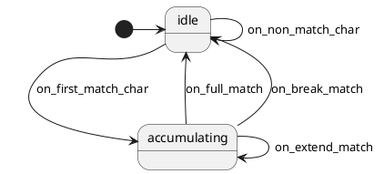

# Autotext — Design

> Branch: `feature/kbsm-autotext`
> Framework: kbsm (Key Behavior State Machine)
> Deployment: SRAM module only (v1)
> Status: design draft for review

---

## Problem

QMK has no abbreviation expansion / autotext feature. Users who type repetitive phrases (email addresses, code snippets, common corrections) have to manually type them every time. Community solutions exist as custom keymap features but require flashing firmware to change the trigger table.

A kbsm-based autotext module would:
- Match typed sequences against a configurable trigger table
- Replace matches with longer expansions via `SEND_STRING`
- Be deployable as an SRAM module — edit + rebuild + upload, no flash

## Solution

Watch key events, accumulate printable characters, and when a configured trigger sequence is matched, retroactively replace it with the configured expansion.

**Mechanism:** "send-then-erase" — typed characters reach the host normally as the user types. When a full match is detected, the module sends backspaces to delete the trigger, then sends the expansion via `SEND_STRING`.

The module is observation-only: it never consumes events (`KBSM_CONSUME`). It sees all key events, accumulates partial matches, and uses `SEND_STRING` + backspaces to rewrite the host when a match fires.

## Comparison with adjacent QMK features

| Feature | Trigger | Differs from autotext how |
|---|---|---|
| Dynamic macros | Record + replay on a key | Autotext fires on typed text, not a dedicated key |
| Leader | Leader key + sequence | Autotext has no leader key; fires on raw typing |
| Key override | Modifier + key | Autotext matches arbitrary character sequences |
| Tap-dance | N taps of one key | Autotext matches multi-character sequences |

## Data model

```c
typedef struct {
    const char *trigger;   // typed sequence (null-terminated)
    const char *expansion; // SEND_STRING output (null-terminated)
} autotext_def_t;

static const autotext_def_t module_autotext[] = {
    { "teh",    "the" },
    { "/email", "alice@example.com" },
    { "btw",    "by the way " },
};
#define MODULE_AUTOTEXT_COUNT (sizeof(module_autotext) / sizeof(module_autotext[0]))
```

Trigger and expansion strings are null-terminated ASCII. No Unicode support in v1.
Triggers should not be prefixes of each other (documented convention; longest-match-wins is deferred).

## State machine



2 states, 4 events. The SM is mostly a topology document — the real matching logic
(prefix scan, buffer management, backspace + SEND_STRING) lives in the adapter.
The SM exists to provide kbsm machinery (init/deinit/handle/reset) and document
the intent.

**Note:** This is the simplest topology of any kbsm example. The SM exists for
consistency with the other examples (sticky-combo, dyad) and to provide the
kbsm lifecycle hooks. A plain C handler would work for this feature, but the
SM form makes it a proper kbsm module.

## Architecture

```
keyevent → kbsm PRE_TAP phase → autotext machine
                                │
                                ▼
                              idle?         → check if char starts any trigger; if so, transition to ACCUMULATING
                              accumulating? → append char to buffer; scan triggers for exact/prefix match
                              (always PASS)  → never consume; module is observation-only
```

### Adapter state

```c
typedef struct {
    Autotext sm;
    kbsm_env_t *env;
    char buffer[AUTOTEXT_MAX_TRIGGER_LEN];  // accumulating partial match
    uint8_t buffer_len;
} autotext_state_t;
```

Where `AUTOTEXT_MAX_TRIGGER_LEN` is a compile-time constant (default 16).

### kbsm_env_t extension

v1 adds `send_string` to the `kbsm_env_t` callback table:

```c
typedef struct kbsm_env {
    /* ... existing fields ... */
    void     (*send_string)(const char *str);  /* NEW in v5 */
    void     *extension;
    uintptr_t module_base;
} kbsm_env_t;
```

The firmware populates this with a pointer to QMK's `send_string`. The module
calls `env->send_string(expansion)` to output the expansion string.

This is an ABI v4 → v5 bump. Documented in `module_api.h` and `kbsm_env.h`.
Adding fields to the end of the struct is backward-compatible for old modules
that never reference the new field.

### Keycode-to-ASCII conversion

To match triggers, the module needs to convert keycodes to printable characters.
QMK keycodes are not ASCII — they're matrix-position-flavored. The adapter
provides a static lookup table:

```c
static const struct { uint16_t kc; char ch; } keycode_to_char[] = {
    { KC_A, 'a' }, { KC_B, 'b' }, /* ... KC_A through KC_Z ... */
    { KC_1, '1' }, { KC_2, '2' }, /* ... KC_1 through KC_0 ... */
    { KC_SPACE, ' ' },
    { KC_SLASH, '/' },
    { KC_DOT, '.' },
    { KC_MINUS, '-' },
    { KC_COMMA, ',' },
    { KC_SEMICOLON, ';' },
    { KC_ENTER, '\n' },
    /* ... more punctuation as needed ... */
    { 0, 0 } /* sentinel */
};
```

For shifted characters (uppercase letters, `@`, `#`, `$`, etc.), the adapter
checks `get_mods()` for shift state and converts accordingly.

**Limitation:** Only QWERTY layout supported. Non-QWERTY layouts (Dvorak,
AZERTY, Colemak) need a custom lookup table. Documented as v1 limitation.

### Dispatch logic

For each key event in `handle()`:

1. If `!event->pressed` → `KBSM_PASS` (only care about presses)
2. Convert keycode to printable ASCII character using `keycode_to_char` table
3. If not printable → break any partial match, clear buffer, `KBSM_PASS`
4. Append character to `buffer`, increment `buffer_len`
5. Linear-scan `module_autotext[]`:
   - For each trigger, check if `buffer` matches its first `buffer_len` chars
   - Collect: (a) any *exact match*, (b) whether any trigger has `buffer` as a strict prefix
6. Decision:
   - **Exact match found**: trigger fired. Send `buffer_len` backspaces, then `env->send_string(expansion)`. Clear buffer, dispatch `ON_FULL_MATCH`, return `KBSM_PASS`
   - **No exact match, but `buffer` is a prefix of some trigger**: still accumulating. Dispatch `ON_EXTEND_MATCH` or `ON_FIRST_MATCH_CHAR`, return `KBSM_PASS`
   - **No exact match and no prefix match**: this character broke the partial match. Re-scan with just this character (it might start a new match). If it doesn't start any trigger, clear buffer, dispatch `ON_BREAK_MATCH`, return `KBSM_PASS`
7. Buffer-overflow guard: if `buffer_len == AUTOTEXT_MAX_TRIGGER_LEN`, force-clear and reset.

**Always returns `KBSM_PASS`.** The module is observation-only — it never
consumes events. The typed characters reach the host; the module uses
backspaces + `SEND_STRING` to retroactively rewrite them.

## Edge cases

| Scenario | Behavior |
|---|---|
| Type `teh` followed by space | `teh` matches exactly on 3rd char; send 3 backspaces, send `"the"`. Net: host shows `the ` |
| Type `tehnical` (typo on the way to "technical") | After `teh`, exact match fires → host shows `the`. Then `n`, `i`, `c`, `a`, `l` continue → host shows `thenical`. User notices and corrects. Standard autotext failure mode. |
| Type `t`, `e`, `h`, backspace, `i`, `s` | After `teh` fires → host shows `the`. User backspaces — but the kbsm machine doesn't know the host state was rewritten. Next char `i` → buffer = `i`, no prefix match → IDLE. Behavior: depends on what user expects; typically fine. |
| Type a non-printable key (arrow, function key) mid-trigger | Break the partial match, reset buffer, transition to IDLE |
| Buffer overflow (longer than `AUTOTEXT_MAX_TRIGGER_LEN`) | Force reset; the user's typing was longer than any trigger anyway |
| Shift held during trigger typing | Triggers are case-sensitive in v1. `TEH` is not `teh`. Documented. |
| User types backspace mid-trigger | Truncate buffer by one, re-scan for prefix match. Or: simpler, clear buffer and reset to IDLE |
| Two triggers where one is a prefix of another (`te` and `teh`) | Trigger fires on first exact match (`te`). The longer trigger (`teh`) never reached. Document the convention: triggers should not be prefixes of each other. |

## Risks

| Risk | Severity | Mitigation |
|---|---|---|
| Keycode-to-ASCII conversion is layout-dependent | High | Document as v1 limitation; provide hook for users to supply their own table |
| Backspace mid-trigger desyncs adapter from host | Medium | Handle backspace as "truncate buffer by one" |
| Prefix triggers (`/` is a prefix of `/email`) | Medium | Document the convention; longest-match-wins is a later enhancement |
| Buffer size constant pessimistic | Low | 16-char default covers most realistic triggers |
| SRAM module size exceeds 4 KB | Low | Estimate ~2 KB; long expansion strings inflate size. User edits the table, so they control the size. |
| The 2-state SM doesn't justify StateSmith | Low | Document the design choice: SM exists for kbsm machinery + topology clarity |
| Rolling-typing inadvertently fires triggers | Medium | Triggers should be uncommon character sequences; document the pattern |

## Out of scope (v1)

- ❌ EEPROM persistence of trigger table
- ❌ QMKata sysex management of triggers
- ❌ Unicode expansions
- ❌ Case-insensitive matching
- ❌ Termination-character mode (fire on space/punct rather than exact match)
- ❌ Longest-match-wins precedence
- ❌ Non-QWERTY layout support
- ❌ Dynamic trigger registration at runtime
- ❌ Trigger groups / contexts
- ❌ Capture groups

## Files

### qmk-tools (new SRAM module example)

```
qmk/QMKata/module_examples/kbsm_autotext/
    autotext.puml               # diagram (2 states, 4 events)
    Autotext.{c,h}              # generated SM (committed)
    autotext_def.h              # user-editable trigger table + keycode→char lookup
    autotext_module.c           # adapter — main complexity here
    README.md                   # build/load instructions + limitations
```

### firmware (env extension + registry entry + feature table)

```
keyboards/keychron/common/module/kbsm_env.h  # add send_string to kbsm_env_t
keyboards/keychron/common/module/kbsm_env.c  # populate send_string
keyboards/keychron/common/module/module_loader.h  # bump ABI version to v5
emulator/scripts/build_sram_module.py  # add autotext entry to FEATURES dict
quantum/features/README.md             # add autotext row
docs/plans/2026-05-24-autotext-design.md  # this doc
docs/plans/2026-05-24-autotext-impl.md    # impl plan (sibling)
```

### qmk-tools (ABI sync)

```
qmk/QMKata/module_api.h  # add send_string to kbsm_env_t, bump ABI version
```

## Testing checklist

1. Build autotext SRAM module — fits in 4 KB slot
2. Hook bitmap matches expected (init, deinit, kbsm_get_machine)
3. Type `teh` → host shows `the`
4. Type `/email` → host shows `alice@example.com`
5. Type `btw` → host shows `by the way `
6. Type `technical` (no match) → host shows `technical`
7. Type `teh` followed by backspace → host shows `the` then backspace
8. Type non-printable key mid-trigger → no match, buffer cleared
9. Buffer overflow → reset to IDLE
10. Sticky-combo and dyad SRAM modules still build byte-identical

## Open questions for review

1. **Keycode-to-ASCII table — hard-coded or user-editable?** My lean: user-editable in `autotext_def.h` alongside the trigger table. Provide a sensible QWERTY default.

2. **Backspace handling — truncate or reset?** Truncate is more user-friendly; reset is simpler. My lean: truncate.

3. **Trigger table size / count limits?** Hard-cap at 32 triggers and 64-char expansions for v1? Or leave it open and let the module size enforce limits?

4. **The 2-state SM critique — acceptable?** 70% consistency with other examples, 30% topology documentation. Acceptable?

5. **Should the design doc explicitly warn that the keycode-to-ASCII layer is the most fragile part?** Yes — users on Dvorak or AZERTY will find this immediately broken without their own table.

6. **Date for filenames.** `2026-05-24-autotext-{design,impl}.md`.

7. **Naming.** `autotext` confirmed. Module prefix `kbsm_autotext`. Adapter prefix `autotext_*`. SM class name `Autotext`.
