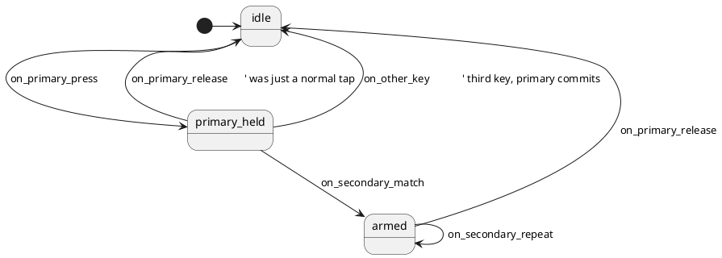

# Dyad — Design

> Branch: `feature/kbsm-dyad`
> Framework: kbsm (Key Behavior State Machine)
> Deployment: SRAM module only (v1)
> Status: design draft for review

---

## Problem

QMK provides several "key combinator" features, each narrowly scoped:

- **Combos** fire on simultaneous press of N keys
- **Key overrides** translate (modifier + key) → other key
- **Tap-dance** translates (single key, N taps/holds) → action
- **Space-cadet** is a specific case: shift-on-hold + paren-on-tap, one key

None of these cover the general case **(letter held) + (other letter tapped) → arbitrary keycode**, which is useful for:

- Compose-key-style accented characters (hold `A`, tap `E` → `á`)
- Two-character mnemonics for macros (hold `;`, tap `G` → open Git status; hold `;`, tap `D` → diff)
- Layouts where a letter doubles as a soft modifier for a subset of other letters
- Per-pair micro-shortcuts without consuming a chord-style global combo

## Solution

A new kbsm feature: `dyad`. Sequential hold-then-tap with a 2D lookup table.

```
[*] → IDLE → (press primary)
        ↓
   PRIMARY_HELD → (release primary)            → IDLE
        ↓        → (third key, no match)       → IDLE (primary commits as normal press)
   (matching secondary tap)
        ↓
     ARMED      → (release primary)            → IDLE
                → (secondary repeats)          → ARMED (output fires again)
```

Each (primary, secondary) row in a const config table maps to an arbitrary output keycode (sent via `tap_code16`). Multiple secondaries can share a primary.

## Comparison with adjacent QMK features

| Feature | Trigger | Differs from dyad how |
|---|---|---|
| Combo | Simultaneous press of N keys | Dyad is sequential; primary must be pressed first and held |
| Key override | Modifier(s) + key | Dyad's "modifier" is an arbitrary letter, not a modifier key |
| Tap-dance | N taps/holds of one key | Dyad involves two keys; the second is a tap, not a count |
| Space-cadet | Modifier on hold, paren on tap | Space-cadet is per-key, dyad is per-pair, and output is configurable |
| Sticky combo (kbsm) | Simultaneous press of 2 keys, then arm for repeat taps | Dyad is sequential, not simultaneous; no auto-arming after release |

## Data model

```c
typedef struct {
    uint16_t primary;     // key held down
    uint16_t secondary;   // key tapped while primary held
    uint16_t output;      // keycode emitted (via tap_code16)
} dyad_def_t;

extern const dyad_def_t dyads[];
extern const uint8_t dyad_count;
```

Example configuration (locale-neutral; users can substitute Unicode keycodes if `UNICODE_ENABLE = yes` in their build):

```c
const dyad_def_t dyads[] = {
    // Hold ; , tap A → Ctrl+A (select all)
    {KC_SCLN, KC_A, LCTL(KC_A)},
    // Hold ; , tap C → Ctrl+C (copy)
    {KC_SCLN, KC_C, LCTL(KC_C)},
    // Hold ; , tap V → Ctrl+V (paste)
    {KC_SCLN, KC_V, LCTL(KC_V)},
    // Hold J , tap K → Escape (common Vim escape mnemonic)
    {KC_J,    KC_K, KC_ESC},
};
const uint8_t dyad_count = 4;
```

## State machine



3 states, 5 events. No `$VARS` (unsupported in PlantUML mode per
`docs/installing-statesmith.md`), no `[guards]`. All decision logic lives
in the adapter.

## Architecture

```
keyevent → kbsm PRE_TAP phase → dyad machine
                                │
                                ▼
                              idle?         → check if primary; if so transition + CONSUME, else PASS
                              primary_held? → match secondary → CONSUME + tap output + transition to ARMED
                                            → third key       → emit deferred primary + PASS third + transition to IDLE
                                            → release primary → tap primary on host + transition to IDLE + CONSUME
                              armed?        → secondary repeat → tap output again + CONSUME
                                            → release primary → transition to IDLE + CONSUME
                                            → other key       → PASS
```

### Adapter state

```c
typedef struct {
    Dyad sm;                       // generated SM (state_id only)
    uint16_t held_primary;         // keycode being held; meaningful when state != IDLE
    int8_t   active_dyad_index;    // -1 if no dyad currently armed; else index for repeat lookup
    bool primary_committed_to_host; // true once register_code16(primary) fired
                                    // (set when "third key" path commits)
} dyad_state_t;
```

The `primary_committed_to_host` flag mirrors sticky-combo's
`pending_pressed_on_host` — adapter-internal deferred-press tracking that
does NOT require any framework-level event-deferral support.

### Deferred primary press (no framework support needed)

When the user first presses the primary key, the adapter doesn't yet know if
this is the start of a dyad or a plain keystroke. The adapter:

1. Consumes the press (`KBSM_CONSUME`) — the primary does NOT reach the host yet
2. Transitions to `PRIMARY_HELD`
3. Resolves the decision on the next event:
   - **Matching secondary tap**: dyad active; never emit the primary
   - **Other key pressed**: primary was a normal hold; `register_code16(primary)` to commit it on the host, then `PASS` the new event
   - **Primary released**: was a tap; `tap_code16(primary)` to emit the brief press

This pattern is feasible in current kbsm because the adapter holds the
decision in its own state and uses direct QMK API calls
(`register_code16` / `tap_code16`). No `kbsm_inject` primitive needed.

### Dispatch logic by state

**IDLE:**
- Press of a key matching any `dyads[i].primary`:
  - Record `held_primary = kc`, transition to PRIMARY_HELD, `KBSM_CONSUME`
- Any other event: `KBSM_PASS`

**PRIMARY_HELD:**
- Press of a key `k` where `(held_primary, k)` matches some `dyads[i]`:
  - `tap_code16(dyads[i].output)`
  - Set `active_dyad_index = i`
  - Dispatch `ON_SECONDARY_MATCH` → ARMED
  - `KBSM_CONSUME`
- Press of any other key:
  - `register_code16(held_primary)`; set `primary_committed_to_host = true`
  - Dispatch `ON_OTHER_KEY` → IDLE
  - `KBSM_PASS` (new key processes normally)
- Release of `held_primary`:
  - `tap_code16(held_primary)` (commit as a brief tap)
  - Dispatch `ON_PRIMARY_RELEASE` → IDLE
  - `KBSM_CONSUME`
- Release of any other key: `KBSM_PASS`

**ARMED:**
- Press of a key `k` where `(held_primary, k)` matches the *same* `dyads[active_dyad_index]` (i.e. its secondary):
  - `tap_code16(dyads[active_dyad_index].output)` (repeat the action)
  - Dispatch `ON_SECONDARY_REPEAT` → ARMED (self-loop)
  - `KBSM_CONSUME`
- Press of another (primary, secondary) match — different dyad row sharing the same primary:
  - Same as above but updates `active_dyad_index` to the new row
  - `tap_code16(dyads[new_i].output)`
  - `KBSM_CONSUME`
- Release of `held_primary`:
  - If `primary_committed_to_host` (shouldn't happen in ARMED, but defensive): `unregister_code16(held_primary)`
  - Dispatch `ON_PRIMARY_RELEASE` → IDLE
  - `KBSM_CONSUME`
- Any other event: `KBSM_PASS`

### kbsm placement

- **Phase**: `KBSM_PHASE_PRE_TAP`
- **Priority**: 60 (runs after sticky-combo at 40 and vim-modal at 50, so dyad sees keys only if those didn't consume — appropriate since dyad's primary is typically a letter, not a combo-participant)
- **Consume rules**: as detailed above

## Edge cases

| Scenario | Behavior |
|---|---|
| Press primary, immediately release (no secondary) | `tap_code16(primary)` — behaves like a normal tap |
| Press primary, press unrelated key, release primary | Primary committed via `register_code16` on third key, then `unregister_code16` on release. Net effect: held key normal behavior |
| Press primary, press matching secondary, release primary without releasing secondary | Output fired on tap, then primary released → IDLE. Secondary release while IDLE: `KBSM_PASS` (sends release of secondary, but secondary's press was never sent to host — possible asymmetry; documented limitation) |
| Same key as primary in multiple dyad rows | All rows are eligible matches; first matching `(primary, secondary)` in table-scan order wins |
| Same `(primary, secondary)` pair in multiple rows | First match wins; later rows ignored (undefined but stable) |
| Modifier keycode as primary or secondary | Works — `register_code16` and `tap_code16` handle modifier keycodes |
| Output is `KC_NO` | `tap_code16(KC_NO)` is a no-op; transition still occurs |
| Two primaries pressed in succession (e.g., hold `;`, then hold `J` without releasing `;`) | `;` is the held primary; `J` is treated as "other key" → `;` commits via `register_code16`, `J` passes through. Only one primary tracked at a time. |
| Rolling typing through a (primary, secondary) pair | Dyad fires. User must avoid letter pairs that are common in their language. Mitigation deferred to v2 (timer guard). |

## Out of scope (v1)

- ❌ EEPROM persistence of the dyad table — compile-time const only
- ❌ QMKata sysex handlers for runtime dyad config
- ❌ Rolling-typing timer guard (fire dyad only if secondary arrives within N ms of primary)
- ❌ Multiple held primaries simultaneously (only one primary tracked)
- ❌ `SEND_STRING`-style output (use `tap_code16` only)
- ❌ Firmware-tree integration — SRAM module only for v1
- ❌ Migration tooling from key-overrides (different semantic; users opt in explicitly)
- ❌ Per-dyad guard predicates (e.g., "only when layer X active")

## Files

### qmk-tools (SRAM module example)

| File | Purpose | LOC est. |
|---|---|---|
| `module_examples/kbsm_dyad/dyad.puml` | State diagram | ~25 |
| `module_examples/kbsm_dyad/Dyad.c` | Generated SM | ~150 |
| `module_examples/kbsm_dyad/Dyad.h` | Generated header | ~50 |
| `module_examples/kbsm_dyad/dyad_def.h` | User-editable dyad table | ~20 |
| `module_examples/kbsm_dyad/dyad_module.c` | Adapter (env-routed) | ~150 |
| `module_examples/kbsm_dyad/README.md` | Build/load instructions | ~60 |

### firmware (build infrastructure)

| File | Change | LOC est. |
|---|---|---|
| `emulator/scripts/build_sram_module.py` | Refactor to dict-driven; add dyad entry | +40 |
| `quantum/features/README.md` | Add dyad to feature table | +2 |
| `docs/plans/2026-05-24-dyad-design.md` | This document | (this file) |
| `docs/plans/2026-05-24-dyad-impl.md` | Implementation plan (sibling) | ~150 |

No firmware code (`quantum/features/dyad*`, `rules.mk` entries, keymap config) in v1.

## Risks

| Risk | Severity | Mitigation |
|---|---|---|
| Rolling typing triggers dyad accidentally | Medium | Document; advise against common letter pairs; v2 timer guard |
| Single-primary limitation surprises users | Low | Document in README; rare in practice |
| 2D table scan O(N) per keypress in PRIMARY_HELD | None | N typically < 20; negligible |
| SRAM module size exceeds 4 KB slot | Low | Comparable in complexity to sticky-combo (1260 bytes); expected ~1500 bytes |
| Confusion with key overrides | Medium | Documented comparison table above; explicit non-goal of replacing key-overrides |
| `Dyad.c` regeneration drift between firmware and qmk-tools | None (v1) | Only lives in qmk-tools; no firmware copy |

## Testing checklist (verification during impl)

1. Build dyad SRAM module — fits in 4 KB slot
2. Hook bitmap matches expected (init, deinit, kbsm_get_machine)
3. Press primary alone, release → primary sent to host as normal tap
4. Press primary, press matching secondary → output sent, primary not sent
5. Press primary, press unrelated key → primary committed; unrelated key passes through
6. Press primary, press matching secondary, press matching secondary again → output sent twice
7. Press primary, press matching secondary, release primary → returns to IDLE
8. Multiple dyads with same primary, different secondaries → each fires correctly
9. Dyads with different primaries → independent
10. Sticky-combo SRAM module still builds byte-identical after build script refactor

## Open questions for design review

1. **Priority value (60).** Above sticky-combo (40) and vim-modal (50). Any reason to put dyad higher (closer to events) instead of lower? My reasoning: dyad's primary is typically a letter, so dyad needing to see events before letter-translators makes sense; but dyad consuming events would block downstream layer-handling features. Defer to review.
2. **Secondary release semantics.** When ARMED and the secondary is released, currently `KBSM_PASS` — but the secondary's *press* was consumed. This is asymmetric: host sees a release without a matching press. May be benign (most hosts don't track unpaired releases) but worth flagging.
3. **Default example dyad table contents.** Recommended above: `;+A/C/V` for copy/paste, `J+K` for Escape. Acceptable? Locale-neutral, no Unicode dependency, demonstrates output diversity.
4. **README target audience.** Aimed at "user who wants to try a kbsm SRAM module" or "contributor learning the SRAM module pattern"? Different emphasis. Lean: contributor-focused, like sticky-combo's README.
