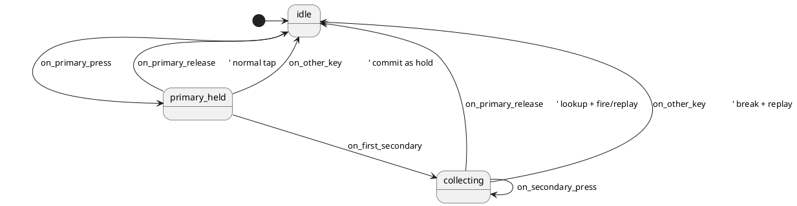

# Holdseq — Design

> Branch: `feature/kbsm-holdseq`
> Framework: kbsm (Key Behavior State Machine)
> Deployment: SRAM module only (v1)
> Status: design draft for review

---

## Problem

QMK has no "hold a key, tap a variable-length sequence, release, fire output" feature. The closest features:

- **Leader key** requires pressing a dedicated leader key first
- **Dyad** (kbsm) is fixed to exactly one secondary tap
- **Dynamic macros** require recording first, then a dedicated playback key
- **Combos** require simultaneous press, not sequential

A rolling macro sequencer lets any key serve as a macro prefix: hold `;` + tap `g`, `o` → fires `"git checkout -b "`. Hold `;` alone → release → types `;` normally. The primary key is both the activator and a normal key — no dedicated macro key needed.

## Solution

A kbsm feature: `holdseq`. Hold primary key, tap any sequence of secondary keys, release primary — lookup the `(primary, sequence)` pair in a config table and fire the expansion via `send_string`. On no-match, replay all consumed keys as normal taps.

## State machine



3 states, 5 events — comparable to dyad (3 states, 5 events). All decision logic (lookup, replay, buffer management) lives in the adapter. StateSmith `$VARS` is unsupported in PlantUML mode v0.21.0-alpha-1 per `docs/installing-statesmith.md`.

## Data model

```c
#define HOLDSEQ_MAX_SEQ_LEN  8
#define HOLDSEQ_MAX_EXP_LEN 128

typedef struct {
    char primary;                         // single char
    char sequence[HOLDSEQ_MAX_SEQ_LEN];   // secondary key sequence
    char expansion[HOLDSEQ_MAX_EXP_LEN];  // send_string output
} holdseq_def_t;

static const holdseq_def_t module_holds[] = {
    { ';', "go",  "git checkout -b " },
    { ';', "pr",  "git pull --rebase " },
    { ';', "co",  "git checkout " },
    { ';', "cm",  "git commit -m \"\"" },
    { 'j', "k",   "jump" },
};
#define MODULE_HOLDSEQ_COUNT (sizeof(module_holds) / sizeof(module_holds[0]))
```

**Inline `char` arrays** — pointer-free. String data lives inside the struct, copied to SRAM. GCC does not emit `R_ARM_ABS32` relocations for `.rodata`→`.rodata` pointer references in SRAM module builds (lesson from autotext debugging). Keycode-to-ASCII lookup table (QWERTY) reused from autotext's pattern.

## Architecture

### Adapter state struct

```c
typedef struct {
    Holdseq sm;
    kbsm_env_t *env;
    uint16_t held_primary;
    char sequence[HOLDSEQ_MAX_SEQ_LEN];
    uint8_t seq_len;
    bool primary_committed_to_host;
    bool firing;                    // guard during replay/send_string
} holdseq_state_t;
```

### Per-state dispatch

**IDLE:**
- Press of a printable key `k` where `keycode_to_ascii(k)` matches any `holds[i].primary` → record `held_primary`, transition to PRIMARY_HELD, `KBSM_CONSUME`
- Any other → `KBSM_PASS`

**PRIMARY_HELD:**
- Press of printable key → start sequence: `seq[0] = char; seq_len = 1`, transition to COLLECTING, `KBSM_CONSUME`
- Release of `held_primary` → `tap_code16(primary)` (normal tap), transition to IDLE, `KBSM_CONSUME`
- Non-printable key → `register_code16(primary)` (commit as hold), transition to IDLE, `KBSM_PASS`

**COLLECTING:**
- Press of printable key, `seq_len < HOLDSEQ_MAX_SEQ_LEN` → append, self-transition, `KBSM_CONSUME`
- Press of printable key, buffer full → replay all consumed, IDLE, `KBSM_PASS`
- Release of `held_primary` → lookup `(ascii(primary), sequence)`:
  - Match → `send_string(expansion)` (firing guard)
  - No match → replay all via `tap_code16`
  - Reset, IDLE, `KBSM_CONSUME`
- Non-printable → replay + pass, IDLE

### Replay mechanism

On no-match or break: `firing = true; tap_code16(primary); for each secondary: tap_code16(char_to_keycode(ch))`; `firing = false`. Synthetic events from `tap_code16` re-enter the handler; the `firing` guard returns `KBSM_PASS` immediately (lesson from autotext's self-reentry bug). Replayed keys bypass the kbsm chain — documented limitation.

### Lessons applied from prior modules

| Lesson | Source module | Applied in holdseq |
|---|---|---|
| Inline `char` arrays, not `const char *` | autotext (relocation bug) | `holdseq_def_t` uses `char primary/sequence/expansion[N]` |
| `firing` guard for synthetic event reentry | autotext | Guard set/cleared around `tap_code16`/`send_string` calls |
| Explicit `.bss` field init in `module_init()` | autotext (stuck firing bug) | `g_state.firing = false; g_state.seq_len = 0;` etc. |
| KBSM_CONSUME for trigger-completing event | autotext (output corruption) | Primary release in COLLECTING returns `KBSM_CONSUME` |

### kbsm placement

- **Phase**: `KBSM_PHASE_PRE_TAP`
- **Priority**: 65 (dyad at 60, autotext at 70)
- **No tick** — all decisions are event-ordered (no timer needed)

## Comparison with dyad

| Aspect | dyad | holdseq |
|---|---|---|
| Secondary count | Exactly 1 | Variable-length (0..N) |
| Fire on | Secondary press | Primary release |
| Table key | (primary, single_secondary) | (primary, sequence_string) |
| Replay on no-match | Drop (KBSM_PASS for unmatched secondary) | Replay all consumed via tap_code16 |
| Adapter complexity | Low (~150 LOC) | Medium (~230 LOC) |

## Edge cases

| Scenario | Behavior |
|---|---|
| Hold `;`, release without tapping | `tap_code16(;)` — normal tap |
| Hold `;`, tap `g`, `o`, release — match | `send_string("git checkout -b ")` |
| Hold `;`, tap `g`, `o`, release — no match | Replay: `tap_code16(;)`, `tap_code16(KC_G)`, `tap_code16(KC_O)` |
| Hold `;`, tap `g`, press `Esc` | Replay `;`+`g`, pass `Esc` |
| Buffer full (≥ MAX_SEQ_LEN) | Force-break, replay all consumed |
| Two primaries held simultaneously | Second primary treated as "other key" → breaks first chord |
| No table entry for this primary | Primary passes through host normally (IDLE → KBSM_PASS) |

## Risks

| Risk | Severity | Mitigation |
|---|---|---|
| Replay via `tap_code16` bypasses kbsm | Low | Documented; matches autotext pattern |
| Keycode-to-ASCII QWERTY-only | Medium | Documented; reuse autotext pattern |
| Rolling-typing risk | Medium | Document — avoid common pairs |
| Inline arrays inflate struct (~136 B/entry) | Low | 25 entries fit 4 KB slot |

## Out of scope (v1)

- ❌ EEPROM persistence, QMKata sysex, Unicode, non-QWERTY, case-insensitive matching
- ❌ Per-sequence timeout, multi-primary, firmware-tree integration

## Files

**qmk-tools:**
```
qmk/QMKata/module_examples/kbsm_holdseq/
    holdseq.puml, Holdseq.{c,h}, holdseq_def.h, holdseq_module.c, README.md
```

**firmware:**
```
emulator/scripts/build_sram_module.py  (+holdseq in FEATURES)
quantum/features/README.md             (+holdseq row)
docs/plans/2026-05-24-holdseq-design.md   (this doc)
docs/plans/2026-05-24-holdseq-impl.md     (impl plan)
```
