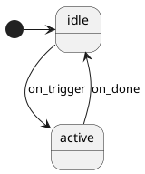

# Key Processing State Machine Pipeline

This directory contains user-extensible key processing features that plug into the
**pipeline orchestrator** (`quantum/pipeline.c/h`). The pipeline is enabled via
`KEY_PROCESSING_SM_ENABLE = yes` in your keymap's `rules.mk`.

## Why this exists

QMK's built-in `process_record_quantum()` chain has 30+ feature processors with
inconsistent hooks: some run in `pre_process_*`, others in `process_*`, others
in `post_process_*`. Adding a new custom feature requires picking the right
entry point and matching the existing pattern.

The pipeline gives you **one uniform plugin interface** (`sm_machine_t`) with
explicit phase boundaries:

```
event → PRE_TAP machines → [tap/hold resolution] → POST_TAP machines → [execute] → POST_EXEC machines
```

Each phase can have multiple machines, dispatched by priority. Any machine can
return `SM_CONSUME` to short-circuit further processing in that phase.

## When to use a state machine

✅ **Use an SM when:**
- Your feature has >5 distinct states with different key behavior
- States are hierarchical (sub-modes within modes)
- Transitions need to be enforced (invalid combinations should be impossible)
- Examples: vim modal layer, macro recorder, wireless mode manager

❌ **Don't use an SM when:**
- Your feature is "is this active or not" (single bool)
- Your feature is a keycode translator (`if (kc == X) do_y()`)
- The adapter would maintain more tracking state than the SM does
- Examples: caps word, key lock, repeat key, most keycode translators

**Rule of thumb:** if your adapter needs 3+ tracking flags to mirror the SM's
state_id, the SM probably isn't earning its keep. Use plain C instead.

## Adding a new feature

### Option A: Plain C handler (most features)

1. Create `quantum/features/my_feature.c`:

```c
#include "pipeline.h"

static struct { bool active; uint16_t timer; } my_state;
static sm_machine_t my_machine;

static sm_result_t my_handle(void *self, keyevent_t *event, keyrecord_t *record) {
    // your logic here — return SM_PASS to forward, SM_CONSUME to suppress
    return SM_PASS;
}

sm_machine_t *my_feature_machine_get(void) {
    my_machine.instance = &my_state;
    my_machine.handle = my_handle;
    my_machine.tick = NULL;   // optional: called every keyboard_task()
    my_machine.reset = NULL;  // optional: called on layer change etc.
    my_machine.name = "my_feature";
    my_machine.phase = PHASE_PRE_TAP;  // or POST_TAP, POST_EXEC
    my_machine.priority = 100;          // lower = runs earlier
    return &my_machine;
}
```

2. Register at boot in `quantum/keyboard.c` `keyboard_post_init_quantum()`:

```c
#ifdef MY_FEATURE_ENABLE
    pipeline_register(my_feature_machine_get());
#endif
```

3. Add build rule in `quantum/rules.mk`:

```makefile
ifdef MY_FEATURE_ENABLE
    SRC += quantum/features/my_feature.c
    OPT_DEFS += -DMY_FEATURE_ENABLE
endif
```

4. Enable in your keymap's `rules.mk`:

```makefile
KEY_PROCESSING_SM_ENABLE = yes
MY_FEATURE_ENABLE = yes
```

### Option B: StateSmith-generated SM (complex modal features)

1. Draw the state machine in PlantUML: `quantum/features/my_feature.puml`



2. Generate C code (StateSmith CLI required, see below):

```bash
~/.local/bin/statesmith run --lang C99 --no-csx --no-ask quantum/features/my_feature.puml
```

This produces `MyFeature.c` and `MyFeature.h` with the generated state machine.

3. Write the adapter (`my_feature_adapter.c`) that dispatches based on `sm.state_id`:

```c
#include "MyFeature.h"

static struct { MyFeature sm; /* other state */ } my_state;

static sm_result_t my_handle(void *self, keyevent_t *event, keyrecord_t *record) {
    typeof(my_state) *st = self;
    switch (st->sm.state_id) {
        case MyFeature_StateId_IDLE:   return handle_idle(st, ...);
        case MyFeature_StateId_ACTIVE: return handle_active(st, ...);
    }
}
```

4. Same registration + build rule steps as Option A. Add the generated `.c` to `SRC`.

## Phases

| Phase | When it runs | Can consume? | Use for |
|-------|--------------|--------------|---------|
| `PHASE_PRE_TAP` | Before tap/hold resolution, raw matrix events | ✅ Yes | Modal layers, gaming macros, key translators |

> `PHASE_POST_TAP` and `PHASE_POST_EXEC` are reserved for future use but
> not yet wired. The framework currently dispatches only `PHASE_PRE_TAP`.

## sm_machine_t interface

```c
struct sm_machine {
    void               *instance;     // your state struct
    sm_result_t         (*handle)(void *self, keyevent_t *event, keyrecord_t *record);
    void                (*tick)(void *self);   // optional, called each loop
    void                (*reset)(void *self);  // optional, called on reset
    const char          *name;        // for debugging
    pipeline_phase_t    phase;        // PHASE_PRE_TAP (others reserved)
    uint8_t             priority;     // lower runs first within phase
};
```

## Current features

| Feature | File | Phase | Type | Enabled in Q3 Max? |
|---------|------|-------|------|--------------------|
| Vim modal | `vim_modal_*` | PRE_TAP | SM (5 states) | ❌ (disabled — would intercept J/K and conflict with sticky-combo SRAM module) |
| Sticky combo | `sticky_combo_*` | PRE_TAP | SM (4 states) | ❌ (replaced by SRAM pipeline module — see below) |

## StateSmith installation

The CLI is needed only when regenerating C code from `.puml` diagrams. Generated
files are committed to the repo, so end users don't need StateSmith installed.

See [docs/installing-statesmith.md](../../docs/installing-statesmith.md)
for installation instructions, usage, troubleshooting, and diagram syntax notes.

Quick regeneration of all SMs:

```bash
make statesmith-gen
```

## Deployment: built-in vs SRAM module

A pipeline feature can ship in two forms:

| Deployment | Persistence | Iteration speed | When to use |
|------------|-------------|-----------------|-------------|
| Built into firmware (e.g. `STICKY_COMBO_ENABLE = yes`) | Survives reset | Rebuild + flash to change | Stable, shipped behaviour |
| SRAM module (loaded via QMKata) | Lost on reset | Edit + rebuild + upload, no flash | Active development, experimentation |

See [docs/sram-modules.md](../../docs/sram-modules.md) for
how to package a feature as an SRAM module, and the worked example at
`qmk-tools/qmk/QMKata/module_examples/pipeline_sticky_combo/`.

## See also

- [Pipeline outcome doc](../../docs/plans/2026-05-11-key-processing-pipeline-outcome.md) — design rationale and lessons learned
- [SRAM modules doc](../../docs/sram-modules.md) — hot-loadable pipeline features
- [StateSmith docs](https://github.com/StateSmith/StateSmith/wiki)
- [Vim modal demo](vim_modal.puml) — example of when SM use is justified
